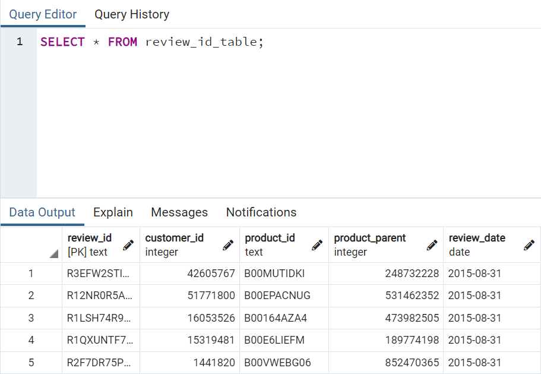
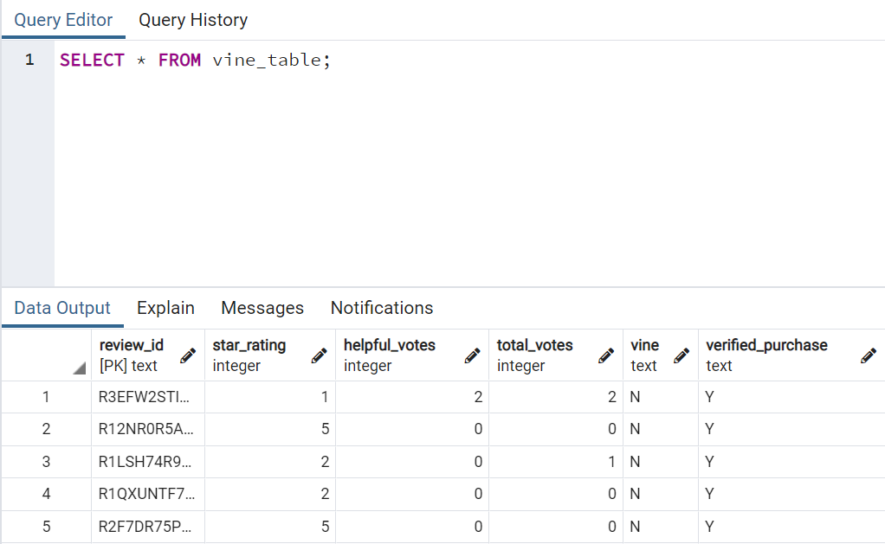
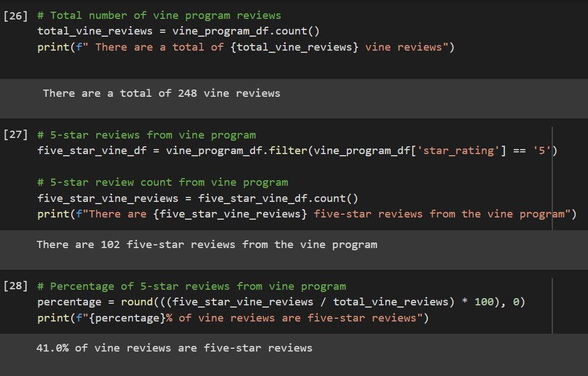
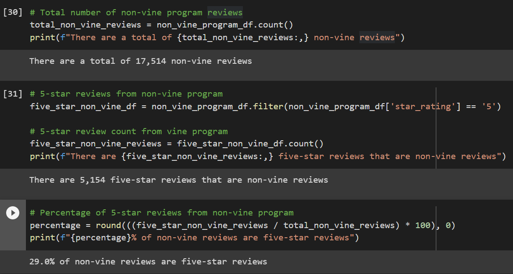

# Amazon_Vine_Analysis
## Project Overview
In the following project, we extracted Amazon product reviews from a dataset stored on Amazon S3. We then leveraged the cloud to streamline the ETL process with AWS, Apache Spark, and PostgreSQL. 
We used the relational database service provided by AWS to create a cloud-hosted server in pgAdmin. From there, we used Google Colab to harness the computing power of Apache Spark to extract, transform, and load the dataset containing the product reviews into our newly created cloud database in pgAdmin. There were a variety of product datasets to choose from, ranging from apparel to consumer electronics. However, in our analysis, we are focusing on software product reviews. The purpose of our project is to determine if there is any bias in the reviews coming from members that are part of the Amazon Vine program and to explore the efficacy of big data technologies coupled with cloud computing resources. 
## Resources
- Google Colab
- Apache Spark & PySpark
- pgAdmin & PostgreSQL 
- AWS
## Results
The following example queries highlight the successful ETL process:         

 

<h3 align="center"> Vine Program Analysis </h3>

 

 
- There are a total of 248 reviews from products included in the vine program.
  - Of those 248 reviews, 102 are five-star reviews, which amounts to roughly 41 % of total reviews.

<h3 align="center"> Non-Vine Program Analysis </h3>

 

 
- There are a total of 17,514 reviews from products that are not part of the vine program.
  - Of those 17,514 reviews, 5,154 are five-star reviews, which amounts to roughly 29 % of total reviews.

## Summary
When comparing the percentage of five-star reviews between the two groups, there is a slight bias for positive reviews in the vine program if we consider only software product reviews. If there were no bias, both groups would have similar percentages of five-star reviews. However, 41 percent of the Vine program reviews are five stars compared to 29 percent of five-star reviews in the data frame that excludes Vine program participants. To confirm our results, we could set up a natural language processing pipeline with the help of PySpark's resources such as tokenizer, StopWordsRemover, IDF, etc. With NLP, we can take the raw text of the reviews from each row, process them, and then apply machine learning models to help us determine the number of positive reviews for each group. We can then compare the output to our initial results for a more robust analysis. 
